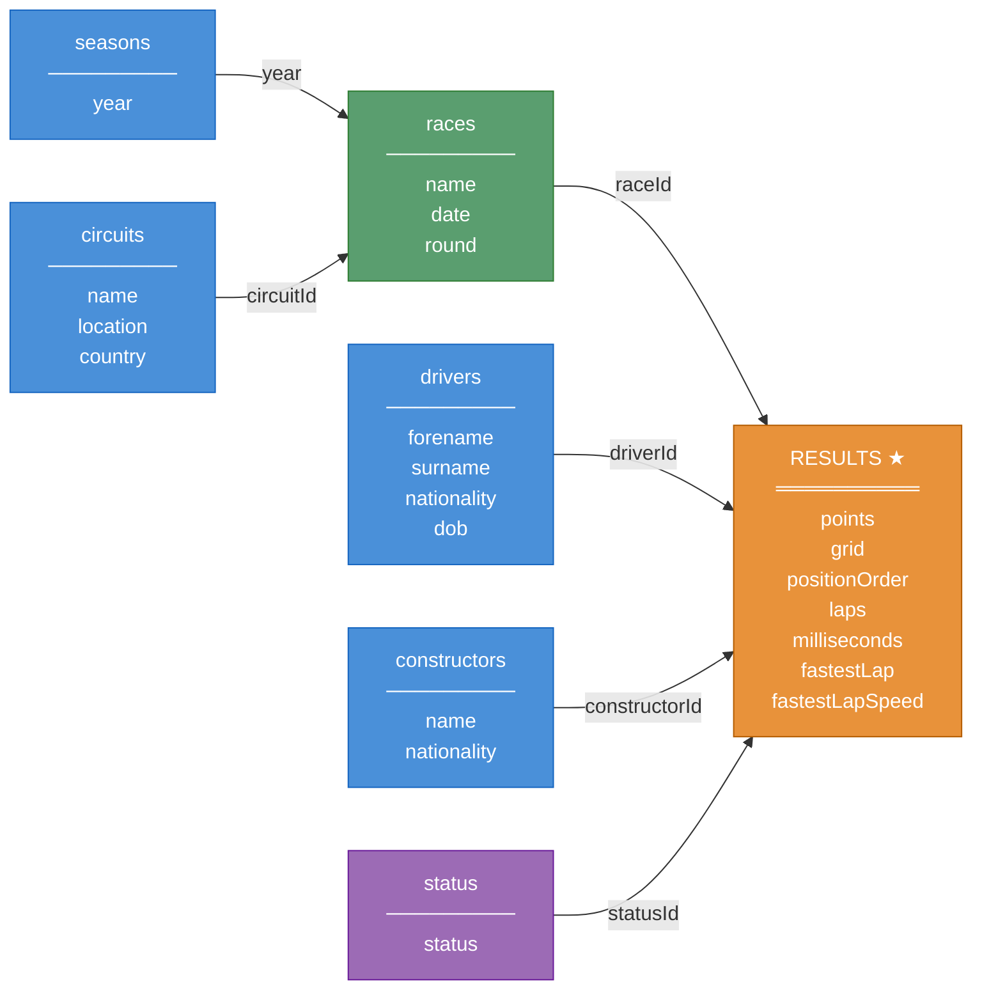
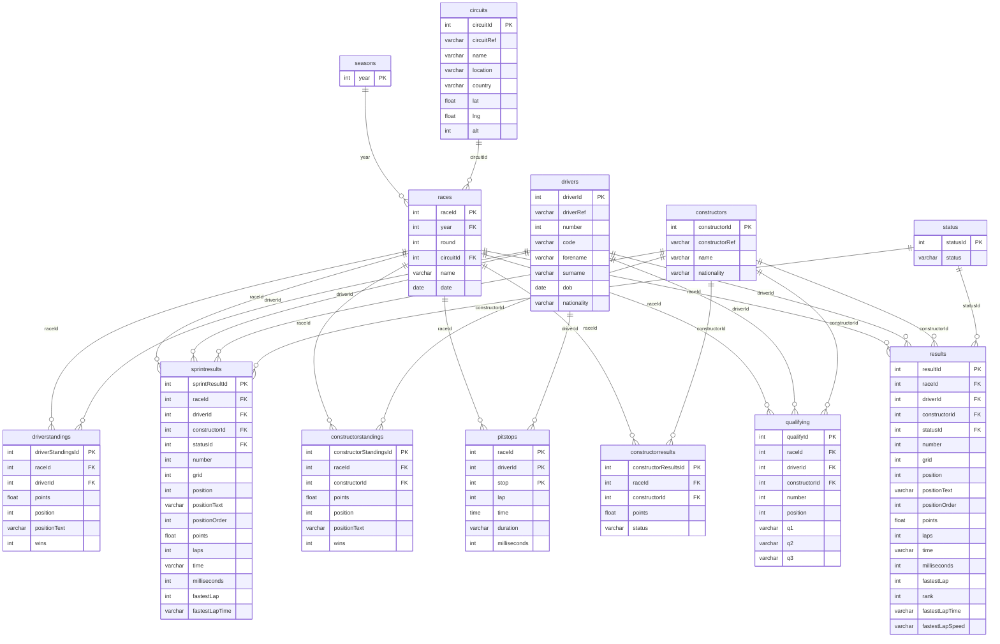

# F1 Data Warehouse — OLAP Demo

A self-contained PostgreSQL + pgAdmin environment for demonstrating OLAP queries. The database is pre-loaded with Formula 1 race data.

## Requirements

- [Docker](https://www.docker.com/get-started) with Docker Compose

## Quick Start

```bash
docker compose up -d
```

Then open **http://localhost:5050** in a browser.

pgAdmin opens directly — no login required. Expand **Servers → F1 Data Warehouse** in the left panel, right-click → **Query Tool**, and enter the database password when prompted:

| Field    | Value    |
|----------|----------|
| Username | `f1user` |
| Password | `f1pass` |

## Database Schema

13 tables covering F1 seasons from 2010 onwards:

| Table | Description |
|---|---|
| `circuits` | Race circuits with location and coordinates |
| `seasons` | Championship years |
| `races` | Individual race events per season |
| `drivers` | Driver profiles |
| `constructors` | Constructor (team) profiles |
| `results` | Race finishing results per driver |
| `driverstandings` | Driver championship standings after each race |
| `constructorstandings` | Constructor championship standings after each race |
| `constructorresults` | Constructor points per race |
| `qualifying` | Qualifying session times (Q1/Q2/Q3) |
| `pitstops` | Pit stop times per driver per race |
| `sprintresults` | Sprint race results |
| `status` | Lookup table for race finish statuses |

## Schema Diagrams

### Dimensional Fact Model

Star schema centred on `results`. Blue nodes are core dimensions, green is the bridge dimension (`races`), purple is the lookup dimension (`status`), and orange is the fact table.



The remaining six tables are secondary fact tables that share the same dimensions:

| Secondary Fact | Dimensions used |
|---|---|
| `pitstops` | races, drivers |
| `qualifying` | races, drivers, constructors |
| `sprintresults` | races, drivers, constructors, status |
| `constructorresults` | races, constructors |
| `driverstandings` | races, drivers |
| `constructorstandings` | races, constructors |

### Entity-Relationship Diagram



## Connection Details

| | |
|---|---|
| Host | `localhost` |
| Port | `5432` |
| Database | `f1_dw` |
| Username | `f1user` |
| Password | `f1pass` |

These credentials work for any external SQL client (DBeaver, DataGrip, psql, etc.).

## Lifecycle Commands

```bash
# Start
docker compose up -d

# Stop (data is preserved)
docker compose down

# Full reset — wipes all data and re-initialises from SQL files
docker compose down -v && docker compose up -d
```

## Sample OLAP Queries

### 1. Ferrari Pit Stop Durations with Running Average (Window Function)

Per-stop duration and year-to-date running average for Ferrari drivers in 2023, excluding outliers ≥ 60 s.

```sql
SELECT 
    ra.name AS race_name,
    ra.round AS gp_round, 
    d.surname AS driver,          
    (p.milliseconds / 1000.0) AS stop_duration_secs,
    AVG(p.milliseconds / 1000.0) OVER (
        PARTITION BY p.driverId
        ORDER BY ra.round, p.stop
    ) AS ferrari_avg_duration_ytd
FROM 
    pitstops p
    JOIN races ra ON p.raceId = ra.raceId
    JOIN results re ON p.raceId = re.raceId AND p.driverId = re.driverId
    JOIN constructors c ON re.constructorId = c.constructorId
    JOIN drivers d ON p.driverId = d.driverId
WHERE 
    c.name = 'Ferrari'
    AND ra.year = 2023
    AND (p.milliseconds / 1000.0) < 60.0
ORDER BY 
    ra.round, 
    p.stop;
```

### 2. Podium Points for First-Time Podium Finishers in 2023 (ROLLUP + NOT EXISTS)

Constructor and driver podium points for the 2023 season, restricted to drivers who reached the top 3 in 2023 but never did so in 2022. ROLLUP adds a subtotal row per constructor.

```sql
SELECT 
    c.name AS team_name,
    d.surname AS driver_name,
    SUM(re.points) AS podium_points
FROM 
    results re
    JOIN races ra ON re.raceId = ra.raceId
    JOIN constructors c ON re.constructorId = c.constructorId
    JOIN drivers d ON re.driverId = d.driverId
WHERE 
    ra.year = 2023
    AND re.positionOrder <= 3
    AND NOT EXISTS (
        SELECT 1
        FROM results re_old
        JOIN races ra_old ON re_old.raceId = ra_old.raceId
        WHERE 
            re_old.driverId = d.driverId  
            AND ra_old.year = 2022
            AND re_old.positionOrder <= 3
    )
GROUP BY 
    ROLLUP(c.name, d.surname)
ORDER BY 
    c.name ASC, 
    GROUPING(d.surname) ASC,
    SUM(re.points) DESC;
```

### 3. Hamilton 2023 — Places Gained per Race with LAG and Running Average (LAG + AVG)

Start vs. finish position for each race, the change vs. the previous race, and the year-to-date running average of places gained.

```sql
SELECT 
    ra.round AS grand_prix_round,
    ra.name AS race_name,
    re.grid AS start_position,
    re.positionOrder AS end_position,
    (re.grid - re.positionOrder) AS gained_places,
    (re.grid - re.positionOrder) - LAG(re.grid - re.positionOrder, 1) OVER w AS gain_diff_to_last_race,
    ROUND(AVG(re.grid - re.positionOrder) OVER w, 2) AS avg_gained_ytd
FROM 
    results re
    JOIN races ra ON re.raceId = ra.raceId
    JOIN drivers d ON re.driverId = d.driverId
WHERE 
    d.surname = 'Hamilton'  
    AND ra.year = 2023
WINDOW w AS (
    ORDER BY ra.round
)
ORDER BY 
    ra.round;
```

## Project Structure

```
.
├── ddl.sql              # Table definitions
├── data.sql             # Seed data
├── docker-compose.yml
└── pgadmin/
    └── servers.json     # Pre-configured pgAdmin connection
```
